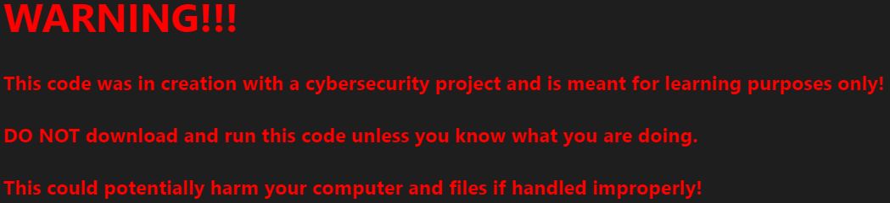

# Cat Coins 

## 

# What Does AtomSmasher Do
- Before delivering AtomSmasher you'll have to run the RSA script to generate two keys, a private and public.
- Once AtomSmasher is on the targets computer It'll encrypt any file under the file_exts in the script  and bring up a ransome note in which the target would have to follow in order to obtain the key which would unlock the files.    

## Disclaimer
This tool is only for testing and academic purposes and can only be used where strict consent has been given. Do not use it for illegal purposes! It is the end user’s responsibility to obey all applicable local, state and federal laws. Developers assume no liability and are not responsible for any misuse or damage caused by this tool and software in general.

## Author
Chris Martinez

### Contributors
Maxoulfou
